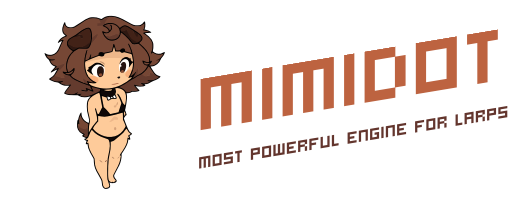

# mimidot

<p align="center">
  
</p>

`mimidot` is a gameplay-first Godot fork aimed at removing workflow friction instead of piling on theoretical features.

## Why pick mimidot

- It keeps the scene tree, node workflow, and GDScript pipeline that already make Godot fast to iterate with.
- It fixes small but constant editor annoyances that slow down actual game work.
- It includes `Mimi Optimizer` so Windows exports can skip optional runtime baggage without forcing a separate renderer mode.

## What is different from stock Godot

- Brown / light-brown / dark-brown editor theme defaults.
- Inspector numeric edits apply more immediately while typing.
- `Ctrl+S` commits the active inspector field before saving.
- 3D editor navigation pans with `MMB` by default, while `Shift + MMB` orbits.
- Windows export presets include `Mimi Optimizer`.
- Built-in unity-like WSR (without using external viewports).

## Recent mimidot changes

- `Mimi Optimizer` now stays focused on safe Windows export trimming instead of relying on a separate renderer experiment.
- Top-level `Control` nodes can use `World Space Rendering` to project UI through a chosen `Camera3D` in runtime while still being authored like normal 2D UI.
- `World Space Rendering` exposes camera assignment, near distance, 3D transform, and follow damping settings directly on the `Control`.

## World Space Rendering

`World Space Rendering` is now built into top-level `Control` roots.

What it does:

- keeps the UI authored as a regular `Control` tree,
- lets the same UI render in front of a `Camera3D` in runtime,
- keeps the UI size stable on screen while still participating in 3D depth,
- exposes extra camera-relative transform controls for stylized HUD and in-world overlay work.

Main properties:

- `world_space_rendering_enabled`
- `world_space_rendering_camera`
- `world_space_rendering_near`
- `world_space_rendering_transform_position`
- `world_space_rendering_transform_rotation_degrees`
- `world_space_rendering_transform_scale`
- `world_space_rendering_follow_damping_enabled`
- `world_space_rendering_follow_damping_speed`

Script access:

```gdscript
ui_root.set_world_space_rendering_enabled(true)
ui_root.set_world_space_rendering_camera($Camera3D)
ui_root.set_world_space_rendering_near(0.8)
ui_root.set_world_space_rendering_position(Vector3(0.0, -0.15, 0.0))
ui_root.set_world_space_rendering_rotation_degrees(Vector3(-6.0, 0.0, 0.0))
ui_root.set_world_space_rendering_scale(Vector3.ONE)
ui_root.set_world_space_rendering_follow_damping_enabled(true)
ui_root.set_world_space_rendering_follow_damping(10.0)
```

Notes:

- It is intended for top-level `Control` nodes, not nested button/label children.
- If the assigned camera is missing, mimidot prints a warning at runtime and keeps the feature disabled until a valid `Camera3D` is assigned.
- If `world_space_rendering_near` is smaller than the camera near plane, fuck you. Change it please.

## Mimi Optimizer

`Mimi Optimizer` lives in the Windows export preset options and focuses on reducing the final runnable folder size.

Current features:

- optional trimming of `AccessKit`, `ANGLE`, and `D3D12` runtime DLLs,
- safer export-side optimization without forking the project renderer,
- clearer status feedback inside the export dialog.

## Build workflow on Windows

Typical tools:

- `MSYS2 UCRT64`
- `MinGW-w64`
- `SCons`
- VS Code

VS Code tasks included in this repo:

- `Build mimidot editor (Release, Max)` is the default `Ctrl+Shift+B` task and uses 12 logical processors.
- `Build mimidot editor (Release, Balanced)` is still available if you want a less aggressive build while working.
- `F5` launches the console editor build through `gdb` and uses the max-parallel build task first.

Manual release build:

```powershell
C:\msys64\ucrt64\bin\scons.exe platform=windows target=editor production=yes arch=x86_64 use_mingw=yes debug_symbols=no -j12
```

## Direction of the fork

`mimidot` is not trying to stay neutral. The goal is to keep stacking practical changes that help real projects move faster:

- tighter editor UX,
- cleaner Windows exports,
- better day-to-day solo-dev ergonomics,
- and fewer moments where the engine sometimes ruins everything.

## - Hey! I wanna build something for windows without recompiling this shit!

Basically, everything you need is to download `mimidot_1.0-release_win_templates_x84_64.zip` in realeases and put them in a directory mimidot does want to get.
Directories list:
```
%APPDATA%\\Mimidot\\export_templates\\4.6.2.stable\\windows_release_x86_64.exe
%APPDATA%\\Mimidot\\export_templates\\4.6.2.stable\\windows_release_x86_64_console.exe
%APPDATA%\\Mimidot\\export_templates\\4.6.2.stable\\windows_debug_x86_64.exe
%APPDATA%\\Mimidot\\export_templates\\4.6.2.stable\\windows_debug_x86_64_console.exe
```
That's all, actually. No crossplatform without recompiling it yourself tho. Gonna add crossplatform any time soon :)